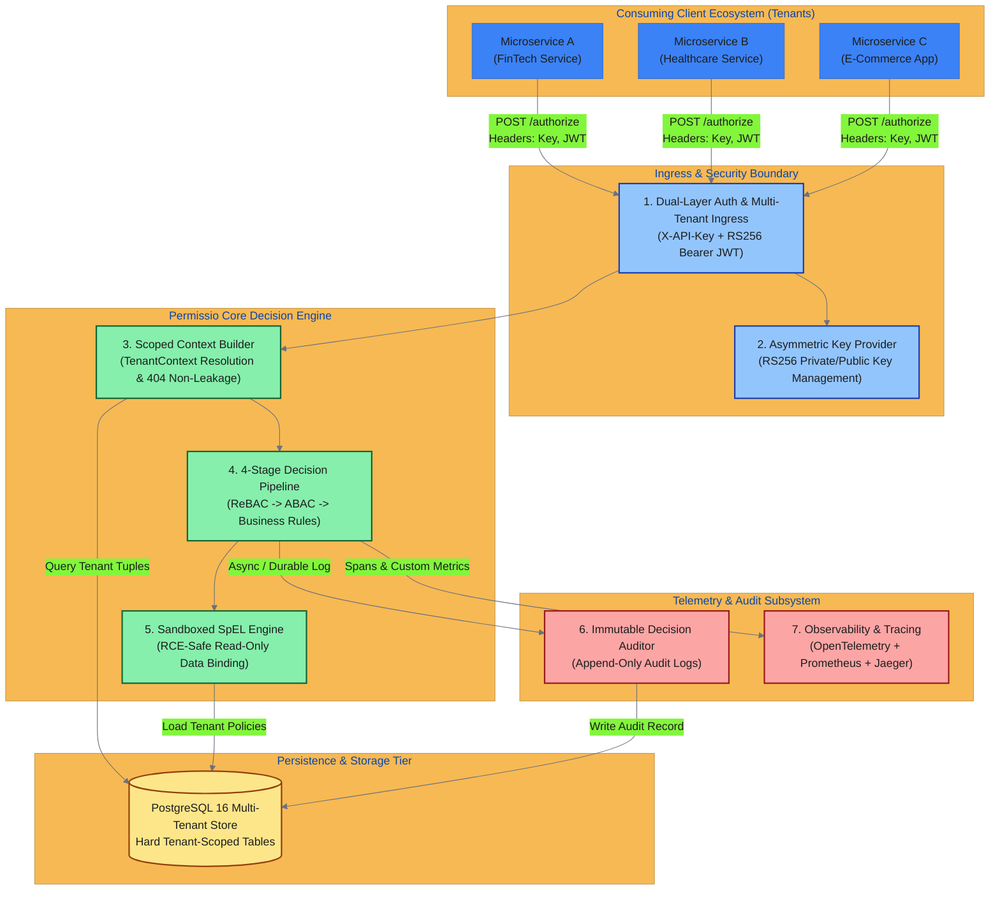
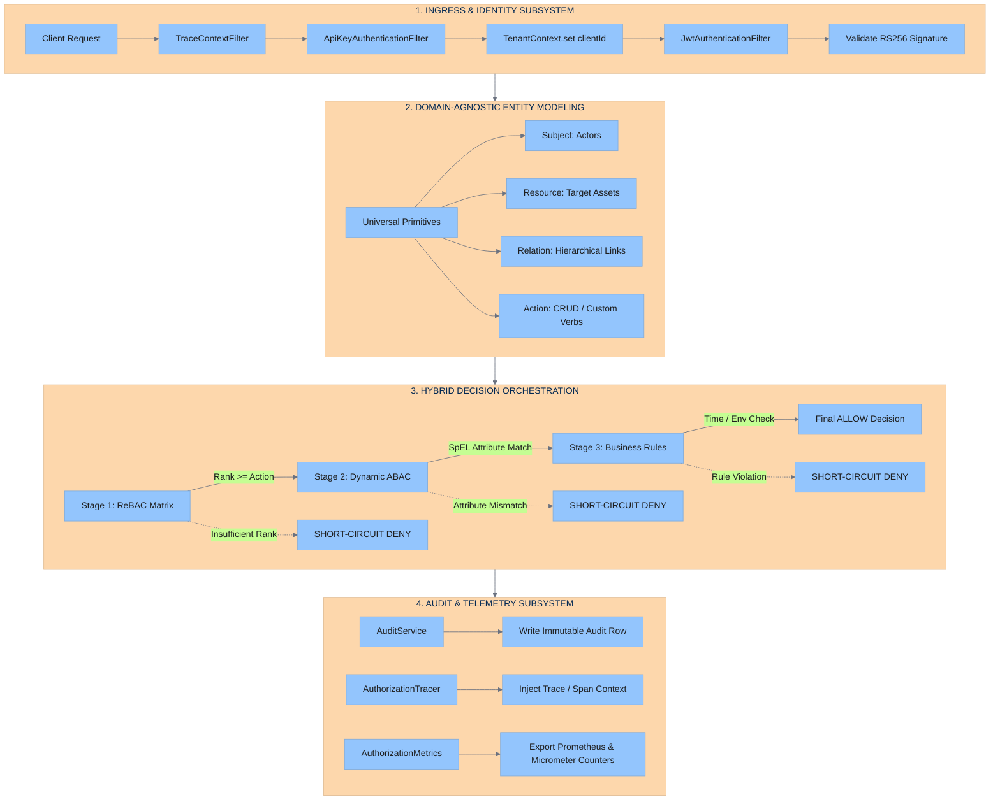
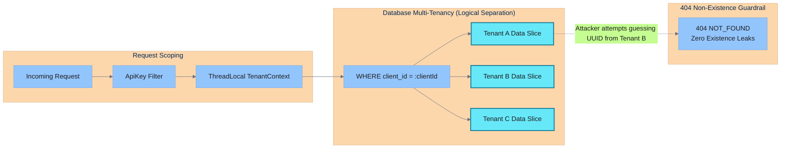
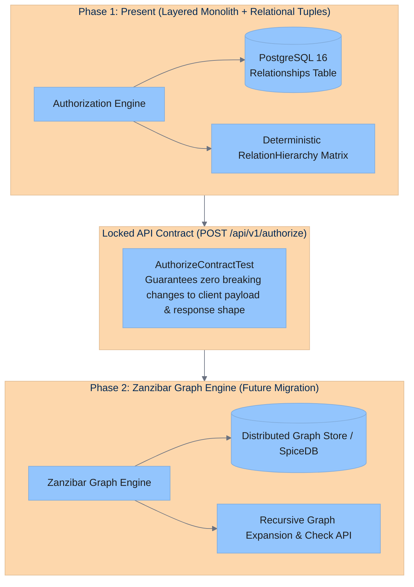

# Permissio — High-Level Design (HLD) & System Architecture

> **System-Level Architecture, Subsystem Topologies, and Component Interactions**  
> Features interactive **Mermaid.js** diagrams with direct deep-links to [Low-Level Design (LLD)](UML_LLD_DESIGN.md) specifications.

---

## 1. Master High-Level Architecture (Interactive Ecosystem)

The following diagram illustrates how external consuming services interact with Permissio, how requests flow through core subsystems, and how data and telemetry are isolated.

> Click on any component box below to jump directly into its **Low-Level Design (LLD)** specification.

---

## 2. Subsystem Breakdown & Architecture Deep Dive

---

## 3. Multi-Tenant Hard Isolation Model

In Permissio, tenants are cryptographically and relationally isolated:

---

## 4. Zanzibar Migration Roadmap (Phase 1 to Phase 2)

Permissio was architected specifically to allow a seamless zero-downtime migration from relational ReBAC (Phase 1) to a full Zanzibar-style distributed relationship graph (Phase 2):

---

## 5. Interactive Navigation Index

| Subsystem | High-Level Description | Detailed Low-Level Design (LLD) Link |
|---|---|---|
| **Multi-Tenant Schema** | Relational data schema, keys & constraints | -> [View Entity Relationship Diagram (ERD)](UML_LLD_DESIGN.md#1-multi-tenant-entity-relationship-diagram-erd) |
| **Security Filter Chain** | API key hashing & RS256 JWT validation | -> [View Filter Chain Sequence Diagram](UML_LLD_DESIGN.md#2-spring-security--multi-tenant-filter-chain) |
| **Engine Class Diagram** | Evaluator plugin hierarchy & engine design | -> [View Authorization Engine Class Diagram](UML_LLD_DESIGN.md#3-authorization-engine-uml-class-diagram) |
| **Decision Pipeline** | Step-by-step evaluation & short-circuiting | -> [View Pipeline Decision Tree](UML_LLD_DESIGN.md#4-post-apiv1authorize-evaluation-pipeline) |
| **Key Lifecycle** | RS256 key management & confusion defense | -> [View Key Lifecycle Flowchart](UML_LLD_DESIGN.md#5-rs256-asymmetric-key-management--lifecycle) |
| **Sandboxed SpEL** | RCE-safe expression evaluation context | -> [View SpEL Sandbox Architecture](UML_LLD_DESIGN.md#6-sandboxed-spel-expression-evaluation-architecture) |
