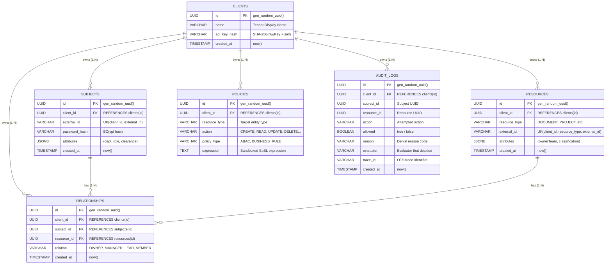
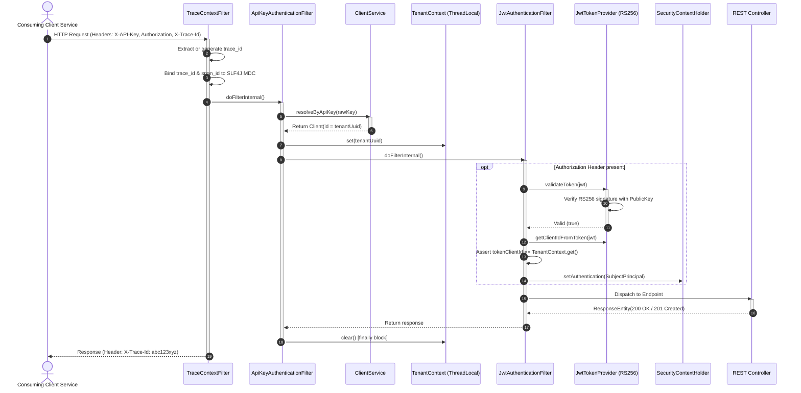
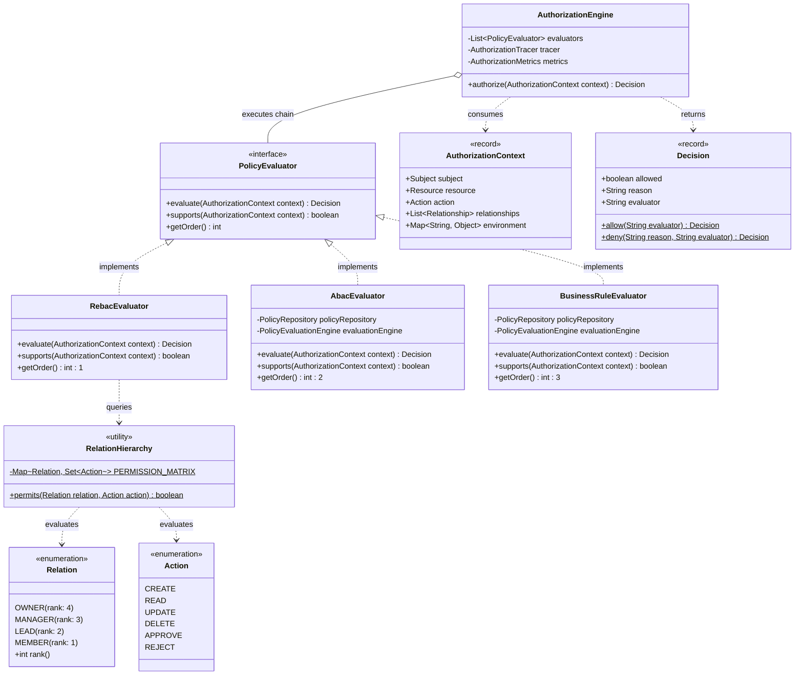
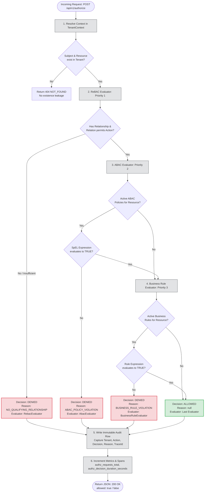
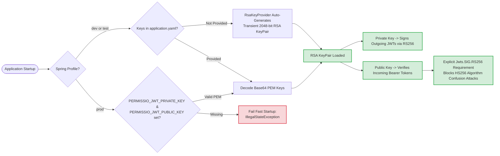

# Permissio — UML Class Diagrams & Low-Level Design (LLD)

> **Visual Architectural Specification & Subsystem Modeling**  
> Rendered using standard GitHub-compatible **Mermaid.js** diagrams.  
> **System Overview:** For the master system-level view, see **[High-Level Design (HLD)](HLD_DESIGN.md)**.

---

## 1. Multi-Tenant Entity Relationship Diagram (ERD)

This diagram models the database schema, foreign key relationships, compound unique constraints, and tenant anchoring across PostgreSQL tables.



---

## 2. Spring Security & Multi-Tenant Filter Chain

Sequence of request interception, MDC correlation, tenant context resolution, and RS256 JWT validation.



---

## 3. Authorization Engine UML Class Diagram

The object-oriented design of the authorization engine, evaluator plugin chain, and domain models.



---

## 4. POST /api/v1/authorize Evaluation Pipeline

Step-by-step decision workflow with short-circuiting logic and audit integration.



---

## 5. RS256 Asymmetric Key Management & Lifecycle

Visualizing key configuration resolution across development, testing, and production.



---

## 6. Sandboxed SpEL Expression Evaluation Architecture

How Permissio isolates policy evaluation to prevent Remote Code Execution (RCE).

```mermaid
flowchart TD
    subgraph Sandboxed Context
        Context[SimpleEvaluationContext<br/>forReadOnlyDataBinding]
        MapSub[#subject: Map of attributes]
        MapRes[#resource: Map of attributes]
        MapAct[#action: String]
        MapEnv[#environment: Map of time, ip, env]
    end

    Policy[Stored Policy String:<br/>#subject.attributes['department'] == #resource.attributes['ownerTeam']] --> Parser[SpEL ExpressionParser]
    
    Parser --> EvalEngine[PolicyEvaluationEngine]
    Context --> EvalEngine
    MapSub --> Context
    MapRes --> Context
    MapAct --> Context
    MapEnv --> Context

    EvalEngine --> Exec{Evaluate}
    Exec -->|Safe Property Access| Result[Boolean: true / false]
    
    subgraph Blocked Malicious Invocations
        Att1[T java.lang.Runtime] -.->|BLOCKED| Error[EvaluationException]
        Att2[new java.io.File...] -.->|BLOCKED| Error
        Att3[System.exit] -.->|BLOCKED| Error
    end

    classDef safe fill:#d1ecf1,stroke:#0c5460,stroke-width:1px;
    classDef block fill:#f8d7da,stroke:#721c24,stroke-width:1px;
    class Context,MapSub,MapRes,MapAct,MapEnv,Result safe;
    class Att1,Att2,Att3,Error block;
```
